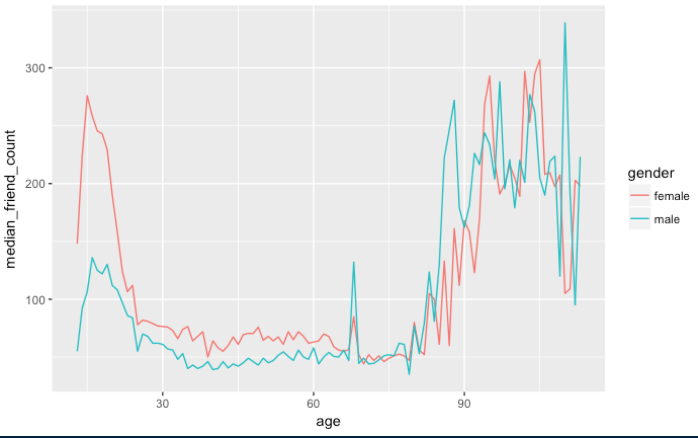
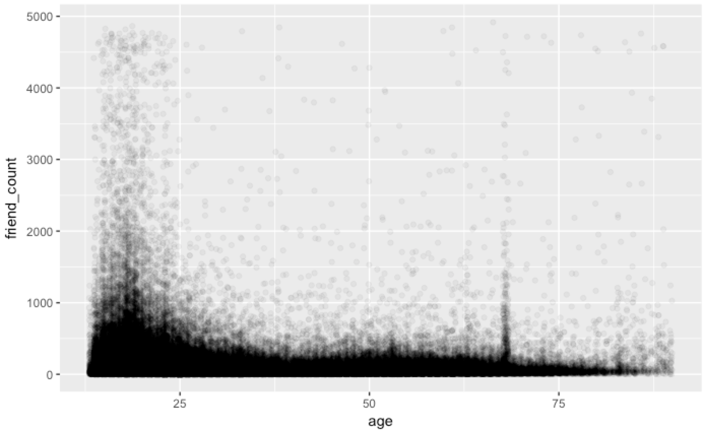
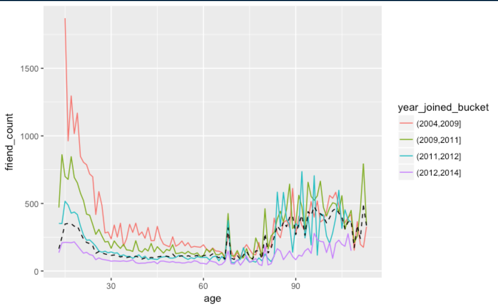

# Pseudo_Facebook_data
Exploratory analysis on the factors that affect friend count for Facebook users.

## Summary of exploratory analysis
* Overall female users tend to have a higher friend count than male users.

* This difference is much more pronounced in teenage users.
* The users with the most friends are typically under 30.
* The bulk of young users have friend count below 1000.

* Pearson product co-efficient suggests that as age increases friend count 
decreases.
* Newer users are more likely to initiate friendships but users that have been 
on Facebook longer tend to have a higher friend count.

